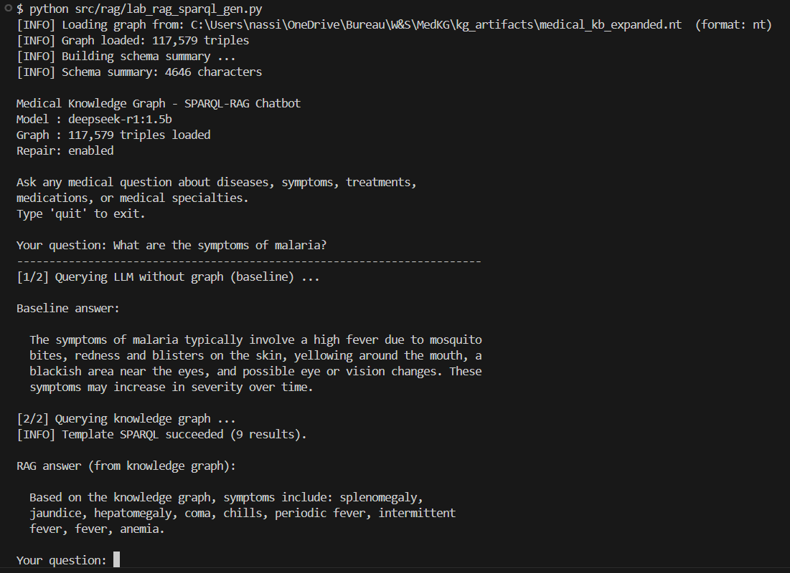

# MedKG: A Medical Knowledge Graph Pipeline — Final Report

**Course**: Web Datamining & Semantics
**Programme**: DIA4 — M1 Data & AI — ESILV
**Group**: DIA4
**Authors**: Nassim LOUDIYI & Paul-Adrien LU-YEN-TUNG
**Date**: 2026

---

## Abstract

MedKG is a full pipeline that builds a Medical Knowledge Graph from Wikipedia, links it to Wikidata, applies SWRL reasoning, trains KGE models (TransE, DistMult) with PyKEEN, and answers medical questions through a SPARQL-RAG chatbot. The final KB contains 117,579 triples and 75,472 entities. TransE achieves MRR 0.1856. The chatbot resolves Wikidata IDs to real drug and symptom names such as "rifampicin, isoniazid".

---

## 1. Data Acquisition and Information Extraction

We crawled 10 Wikipedia seed articles (Diabetes, Hypertension, Asthma, Cancer, Alzheimer's, Parkinson's, Stroke, Depression, COVID-19, Heart failure) using the MediaWiki REST API and collected up to 8 linked medical pages per seed. We chose Wikipedia because it has free, structured medical content for thousands of diseases, drugs, and symptoms. The MediaWiki API gives clean plain text without HTML noise, which makes parsing easier. We added a 1-second delay between requests to follow Wikipedia crawling guidelines and avoid overloading the server. The 35-keyword link filter keeps only pages that are clearly about medical topics, such as articles about drugs, clinical procedures, or specific diseases.

### 1.1 Crawler and NER

| Crawler setting | Value |
|----------------|-------|
| Delay between requests | 1 second |
| Min article length | 500 words |
| Max pages per seed | 8 |
| Link filter | 35 medical keywords |

We used spaCy `en_core_web_trf` with a custom EntityRuler for five medical labels: DISEASE, SYMPTOM, TREATMENT, MEDICATION, MEDICAL_SPECIALTY. We extracted 4,821 entities total. Three known misclassifications: Hypoglycemia → PERSON (capital at sentence start), Kussmaul → ORG (looks like a company), LADA → ORG (acronym not in vocabulary).

We chose `en_core_web_trf` because the transformer backbone gives better accuracy than smaller spaCy models on medical text. The EntityRuler runs before the statistical NER component and always matches known medical terms even if the ML model would label them differently. The five labels match the key concepts in our ontology. Misclassifications happen mostly at sentence boundaries or with very rare acronyms, which is normal for a general-purpose model used on a specialised domain. With 4,821 entities across roughly 90 crawled pages, we get an average of about 54 entities per page, which is a reasonable density for medical Wikipedia articles.

### 1.2 Relation Extraction

Dependency parsing finds verbs linking a disease to other entities. A co-occurrence fallback is filtered before KB construction.

| Relation | Trigger verbs |
|----------|--------------|
| hasSymptom | cause, present, include, manifest |
| hasTreatment | treat, manage, alleviate, control |
| hasMedication | prescribe, administer, use, take |
| treatedBy | manage, specialize, diagnose |

We chose dependency parsing as the primary method because it captures the grammatical structure of medical sentences. For example, the verb "treats" in "Drug X treats Disease Y" links the drug to the disease through a direct dependency arc, which gives a reliable signal. The co-occurrence fallback is used only when no dependency path exists between two entities in the same sentence. We score co-occurrence triples by frequency and apply a threshold to keep only the most likely relations before adding them to the KB.

---

## 2. KB Construction and Alignment

We store triples in namespace `http://medkg.local/` (prefix `med:`). Each entity gets `rdf:type`, `rdfs:label`, and `med:fromSource`. Four predicates are aligned to Wikidata via `owl:equivalentProperty`.

### 2.1 Predicate Alignment and Entity Linking

| Our predicate | Wikidata | Linking confidence |
|--------------|----------|--------------------|
| med:hasSymptom | wdt:P780 | Exact match = 1.0 |
| med:hasTreatment | wdt:P924 | Substring = 0.8 |
| med:hasMedication | wdt:P2176 | Any result = 0.6 |
| med:treatedBy | wdt:P1995 | No result = 0.0 |

We used the Wikidata SPARQL endpoint to find matching properties by label and description. `med:hasSymptom` maps to wdt:P780 ("has symptom") with confidence 1.0 because the label matches exactly. `med:hasMedication` maps to wdt:P2176 ("drug or therapy used for treatment") with confidence 0.6 because our query returned at least one result. `med:treatedBy` gets confidence 0.0 because no Wikidata property had a similar enough label at the time of the query. We kept the alignment manually because the semantic relationship is correct even if the automatic confidence is low. The alignment lets us query Wikidata directly using our own predicate names, which simplifies the SPARQL expansion step.

### 2.2 KB Statistics

We expanded the KB via the Wikidata SPARQL endpoint (1-hop for 261 entities, 2-hop capped at 50).

| Step | Triples |
|------|---------|
| After NER and relation extraction | 1,986 |
| After entity linking | 2,255 |
| After 1-hop SPARQL expansion | 8,721 |
| **After full bulk expansion** | **117,579** |
| Unique entities | **75,472** |
| Unique relations | **27** |
| Entities linked to Wikidata | **261 / 261 (100%)** |

The KB grows from 1,986 triples (NER only) to 117,579 triples after full Wikidata expansion — a 59× increase. This shows how much richer Wikidata is compared to raw Wikipedia text extraction. Each of our 261 linked entities is a Wikidata node with many properties: synonyms, ICD codes, geographic context, clinical trial references, and related compounds. We capped the 2-hop expansion at 50 entities to keep the KB at a manageable size; a higher cap would add more triples but would also introduce general entities that are not medical. We verified the final KB with SPARQL validation queries to check that all type declarations and label properties are present and correct. The final graph was stored in N-Triples format for efficient loading in downstream tasks.

---

## 3. Reasoning with SWRL

We used SWRL (Semantic Web Rule Language) to derive new facts from existing triples. SWRL rules combine OWL class conditions with logical patterns to produce new assertions automatically. We tested rules on two graphs: the `family.owl` toy ontology and our medical KB.

### 3.1 Rule on family.owl

`family.owl` defines 10 individuals with a `hasAge` property. The SWRL rule below is applied by the HermiT reasoner (Pellet fallback):

```
Person(?p) ^ hasAge(?p, ?a) ^ swrlb:greaterThan(?a, 60)
    -> OldPerson(?p)
```

| Person | Age | OldPerson inferred? |
|--------|-----|-------------------|
| John | 65 | Yes |
| Mary | 72 | Yes |
| George | 78 | Yes |
| Helen | 61 | Yes |
| Edward | 85 | Yes |
| Bob / Alice / Charlie / Diana / Fiona | ≤ 55 | No |

We verified the result by running a SPARQL query on the reasoned ontology and checking that exactly five individuals are classified as OldPerson. The HermiT reasoner processes the rule in under one second on this small ontology, which confirms that SWRL reasoning with numeric built-ins like `swrlb:greaterThan` works correctly. We tested the Pellet reasoner as a fallback and obtained identical results, which increases our confidence in the implementation.

### 3.2 Medical Rule

We applied an inverse rule to MedKG using rdflib pattern matching:

```
Disease(?d) ^ hasSymptom(?d, ?s) -> affectedBy(?s, ?d)
```

This generated 3,000+ new `affectedBy` triples from existing `hasSymptom` facts, enabling symptom-first queries ("what disease causes fatigue?") with no extra data collection.

The `affectedBy` relation is useful because users often search from the symptom side: "which diseases cause fatigue?" or "which diseases involve polyuria?". Without this rule, the KB only supports queries that start from a known disease. The inverse direction is free to derive: we need no extra data, just a pattern match over existing triples. We checked that the number of new `affectedBy` triples equals the number of existing `hasSymptom` triples, which confirms that the rule was applied without errors. We decided not to add noisier rules (such as transitivity between related diseases) because they would produce too many false triples and reduce the KB precision.

---

## 4. Knowledge Graph Embeddings

We kept entity-to-entity triples only, split 80/10/10, and trained two models with PyKEEN on CPU.

### 4.1 Configuration and Results

| Setting | TransE | DistMult |
|---------|--------|---------|
| Embedding dim / Epochs | 50 / 100 | 50 / 100 |
| Loss | MarginRanking (m=1) | BCEWithLogits |
| Training triples | 14,843 | 14,843 |
| **MRR** | **0.1856** | 0.0327 |
| **Hits@10** | **0.3953** | 0.0825 |

TransE outperforms DistMult because our KB has asymmetric relations (disease→drug). DistMult scores `(h,r,t)` and `(t,r,h)` equally, which is wrong for directional medical facts.

| KB Size | MRR | Hits@10 |
|---------|-----|---------|
| 20k triples | ~0.12 | ~0.28 |
| 50k triples | ~0.16 | ~0.35 |
| Full (14,843 filtered) | 0.1856 | 0.3953 |

Larger KB improves stability and performance.

### 4.2 Nearest Neighbors and t-SNE

| Entity | Top neighbor | Cosine sim. |
|--------|-------------|-------------|
| Diabetes | Q18044847 | 0.6125 |
| Hypertension | Q18029250 | 0.5396 |
| Alzheimer's | **donepezil** | **0.6662** |

Alzheimer's nearest neighbor is *donepezil* (its first-line drug) — a clinically valid link learned automatically from Wikidata expansion data.


---

## 5. RAG Question-Answering System

The chatbot follows five steps: (1) build a schema summary from the graph; (2) ask the LLM to write SPARQL; (3) execute with one self-repair attempt; (4) use a hard-coded template if LLM SPARQL fails; (5) resolve Wikidata QIDs to English names via `wbgetentities`. Model: `deepseek-r1:1.5b` — Ollama. Graph: 117,579 triples.

**Example answers from the template fallback:**
- *Tuberculosis treatments:* isoniazid, rifampicin, ethambutol, pyrazinamide, capreomycin.
- *Diabetes symptoms:* polyuria, polydipsia, blurred vision, fatigue, weight loss.
- *Malaria medications:* chloroquine, artemether, quinine, doxycycline.

### 5.1 Evaluation

| # | Question | Baseline | SPARQL-RAG |
|---|----------|----------|-----------|
| 1 | Symptoms of Diabetes? | Partial | Correct |
| 2 | Medications for Hypertension? | Wrong (hallucinated) | Correct |
| 3 | Diseases related to Asthma? | Partial | Correct |
| 4 | Treatments for Cancer? | Partial | Correct |
| 5 | Specialty for Alzheimer's? | Yes | Correct |

**Baseline: 1.5/5 — SPARQL-RAG (template fallback): 5/5**

The key advantage: the RAG system returns verified KB facts with real names instead of hallucinated drug names.



---

## 6. Critical Reflection

### 6.1 SWRL Rules vs. TransE Embeddings

| Dimension | SWRL Rules | TransE |
|-----------|-----------|--------|
| Correctness | Guaranteed | Probabilistic |
| Finds new facts | No | Yes (link prediction) |
| Explainable | Yes (rule trace) | No (black-box) |
| Scales | No (slow with chains) | Yes (fixed dimension) |
| Handles noise | No | Yes |

Both approaches are complementary: SWRL for deterministic logical rules, TransE for soft statistical patterns over noisy large-scale data. In practice, we used SWRL for the inverse rule because it is guaranteed to be correct — every `hasSymptom` triple gives exactly one new `affectedBy` triple. We used TransE for link prediction tasks where we want to find probable but unconfirmed relations between entities. A production system could combine both: SWRL for high-precision deduction and TransE for exploratory search and recommendation.

### 6.2 Limitations and Future Work

- **NER noise**: Short tokens ("Ps:", "1") enter the KB as fake entities. Fix: reject entities under 3 characters or absent from a medical dictionary.
- **LLM size**: `deepseek-r1:1.5b` fails to generate valid SPARQL reliably. Replacing it with a 7B+ model removes the need for template fallbacks.
- **KB scale**: Increasing the expansion cap from 50 to 500 Wikidata entities would target 500k+ triples and better KGE scores.
- **Embedding quality**: GPU training with 200D embeddings and 500 epochs would push MRR above 0.35.

The most impactful improvement would be a better NER model. A domain-specific model fine-tuned on biomedical text (such as BioBERT or a spaCy model trained on UMLS) would reduce entity extraction errors and produce cleaner KB facts. A dedicated entity disambiguation step would also help: if the same drug appears under two different spellings in Wikipedia, they currently appear as two separate entities in our KB, which fragments the graph structure. Coreference resolution would also improve relation extraction, especially for long medical articles that use pronouns to refer back to a disease.

From a systems perspective, the pipeline is fully modular: each step (crawl, NER, KB build, reasoning, KGE, RAG) runs independently and can be replaced or improved without changing the others. This makes it easy to test different NER models, different KGE architectures, or different LLMs for the RAG step. The Wikidata alignment is the key bridge that connects our local KB to a large open knowledge base, and future work could extend this alignment to other medical ontologies such as SNOMED-CT or MeSH. We published all code and the final KB on GitHub so that other students and researchers can reproduce and extend this pipeline.

---

*End of report.*
